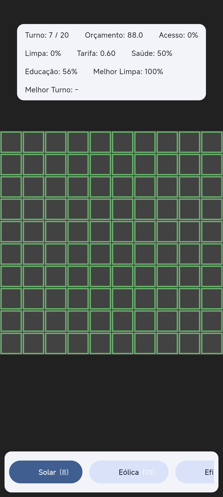
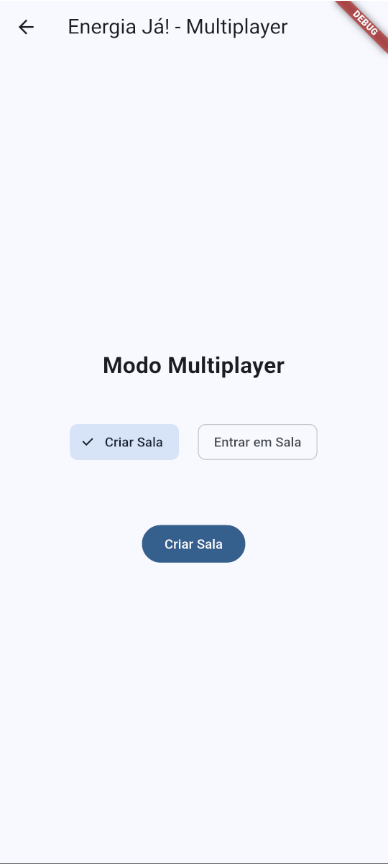

# ⚡ Energia Já!

**Energia Já!** é um jogo educativo **multiplayer em tempo real** para dispositivos móveis, desenvolvido em **Flutter** com o framework **Flame**.  
O projeto tem como foco a conscientização sobre os **Objetivos de Desenvolvimento Sustentável (ODS)**, em especial o **ODS 7 – Energia Limpa e Acessível**.

---

## 🎯 Objetivo

Promover a **educação ambiental e energética** por meio de um jogo interativo, no qual múltiplos jogadores tomam **decisões estratégicas em tempo real**, colaborando ou competindo para desenvolver **cidades sustentáveis**.

---

## 💡 Descrição

No jogo, os jogadores compartilham um mesmo ambiente de simulação e devem **equilibrar recursos, custos e impactos sociais e ambientais** para expandir suas cidades.  
As mecânicas incluem:

- Construção e gerenciamento de cidades sustentáveis 🌱
- Tomada de decisão estratégica sobre o uso de energia ⚡
- Dinâmicas de **cooperação** e **competição saudável** entre jogadores 🤝🏽
- Simulação em tempo real com foco em **sustentabilidade** 🌍

---

## 🧾 Justificativa

Além de conscientizar sobre a importância da **energia limpa**, o componente multiplayer amplia o **engajamento** e promove a **troca de experiências** entre jogadores.  
O projeto busca unir **tecnologia, sustentabilidade e gamificação**, oferecendo uma experiência inovadora para sensibilizar sobre os desafios e soluções do futuro energético.

---

## 🚀 Tecnologias

- [Flutter](https://flutter.dev/)
- [Flame Engine](https://flame-engine.org/)

---

## 📌 Status do Projeto

Em desenvolvimento 🔧

---

## 📷 Preview

  

<em>Visualização da interface principal do projeto</em>

  

<em>Visualização da interface principal do jogo</em>

  

<em>Visualização da interface do modo multiplayer</em>

---

## 📄 Licença

Este projeto é distribuído sob a licença MIT.  
Sinta-se livre para usar, modificar e compartilhar.

## APK LINK: https://drive.google.com/file/d/1yZtjA5qsZMKBPYO4nP1RZCt0RxeEANx9/view?usp=sharing